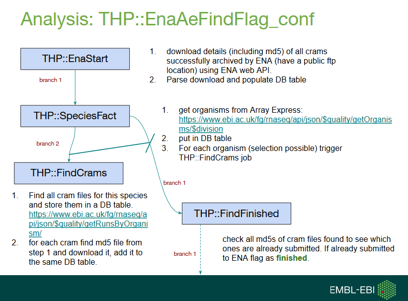
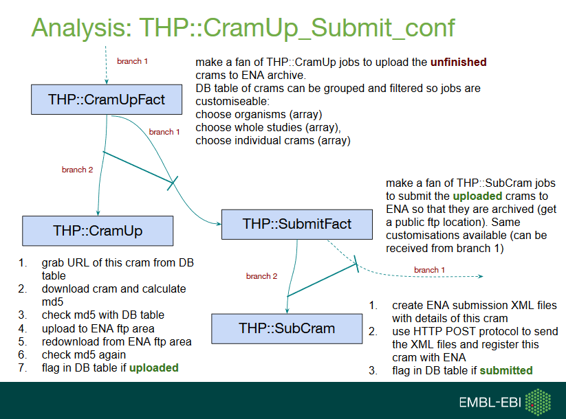
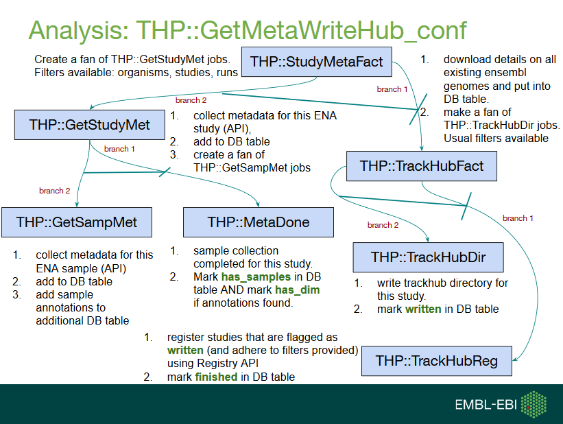

# RNAseqTHS pipeline

The Track Hub Pipeline (THP) is used in Ensembl Plants to update RNAseq tracks mapped to plant genome assemblies from ENA. It was created originally by Marc Rosello and uses [ensembl-hive](https://github.com/Ensembl/ensembl-hive) to control the submission of jobs.

